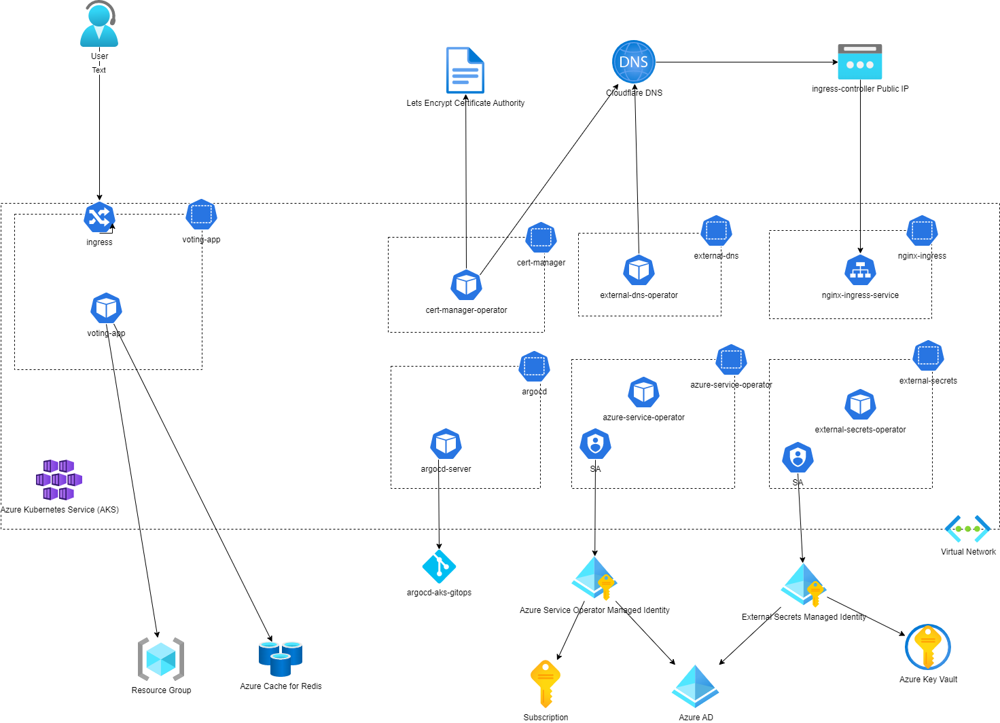

# aks-infra

Setup of an aks cluster with terraform.

## Architecture overview



The GitOps based deployments in AKS are managed through ArgoCD and the corresponding [repository](https://github.com/baloise-incubator/aks-argo-gitops).

## Local setup

You need:
- azure cli
- terraform cli
- kubectl

Setup the variables in a `terraform.tfvars` file, see the example `terraform.example.tfvars`.

### Login
```bash
az login
```

### Switch to your subscription
```bash
az account set --subscription="YOUR_SUBSCRIPTION_ID"
```

### Initialize terraform and providers
```bash
terraform init
```

### apply scripts and start provisioning (takes ~8 minutes)
```bash
terraform apply --auto-approve
```

### Cleanup afterwards to destroy all ressources
```bash
terraform destroy --auto-approve
```